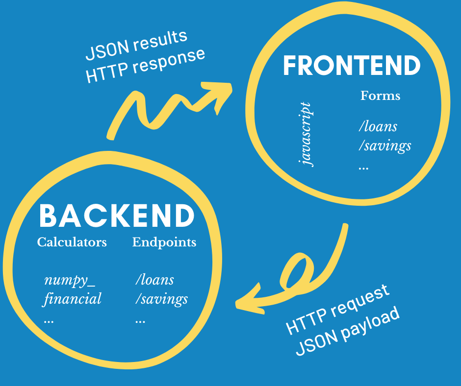

## Financial Calculator
### 3-Minute Project Review


---
@title[The Problem]

@snap[west span-40 text-center]
### The Problem
@img[](assets/img/yellow-ruler.png)

@ul[list-spaced-bullets text-06](false)
- Pedro is an author and speaker of personal finances
- His audience learns by solving problems
- Pedro needs a branded financial calculator to complement his book and keynotes
@ulend
@snapend

@snap[east span-50 text-center]

@snapend


---?color=#fbd95e
@title[The Requirements]

@snap[north span-100 text-center]
### @color[#1585c2](The Requirements)
@img[](assets/img/white-ruler.png)
@snapend

@snap[midpoint span-100 text-07]
@ol[text-black requirements-list](false)
1. Pedro provided a list of 14 calculators, grouped in four categories:  savings, loans, retirement, and credit cards
2. For each calculator, Pedro gave us an Excel sheet with sample inputs and results
    - He used Excel's financial formulas to compute the results
    - The results include specific values, tabular data, and graphs
    - The calculator must emulate the Excel calculations and the presentation of the results
3. The calculator should be compact.  All inputs should be visible within a cellphone's viewport
@olend
@snapend


---
@title[The Design]

@snap[north span-100 text-center]
### The Design
@img[](assets/img/yellow-ruler.png)
@snapend

@snap[west span-50 text-center architecture]

@snapend

@snap[east span-40 text-center]
@ul[list-spaced-bullets design-list text-05](false)
- The app consists of 2 loosely coupled services: a backend and a frontend
- I used Python for the backend because numpy_finance functions map one-to-one with Excel's financial formulas
- The backend does all computations and returns the results ready for presentation
- The frontend sends requests with calculation parameters as JSON and manipulates the DOM to present the results
@ulend
@snapend

---
@title[Backend: Code Organization]

@snap[north span-100 text-center]
### Backend: Code Organization
@img[](assets/img/blue-ruler.png)
@snapend

@snap[east span-30 text-center]
``` zoom-05 file-structure
project
|____calculators
|    |    calculators.py
|    |    credit_card_calculator.py
|    |    loan_calculator.py
|    |    retirement_calculator.py
|    |    saving_calculator.py
|
|____resources
|    |    calculators.py
|    |    credit_cards.py
|    |    loans.py
|    |    retirements.py
|    |    savings.py
|
|____tests
|    |    base_test.py
|    |    test_credit_card_calculators.py
|    |    test_loan_calculators.py
|    |    test_retirement_calculators.py
|    |    test_saving_calculators.py
|
|    app.py
|    config.py
|    requirements.txt
|    run.py
```
@snapend

@snap[west span-60 text-white text-07]
@ul[list-spaced-bullets code-org-list](false)
- I organized the code into three packages:
    - **calculators** - contains the calculator classes
    - **resources** - contains the blueprint and the endpoints
    - **tests** - contains the automated tests
@ulend
@snapend


---
@title[Backend: Classes]

@snap[north span-100 text-center]
### Backend: Classes
@img[](assets/img/blue-ruler.png)
@snapend

@snap[east span-60 text-center]
@code[python zoom-05](calculators/calculator.py?tags=calculator_class)
@snapend

@snap[west span-30 text-white text-05]
@ul[list-spaced-bullets code-org-list](false)
- I coded a **Calculator** class with attributes and methods common to all the calculator categories
- I added a class for each of the calculator categories
- These classes inherit from the **Calculator** class
@ulend
@snapend


---?image=assets/img/code.jpg&opacity=60&position=left&size=45% 100%

@snap[east span-50 text-center]
## Now It's **Your** Turn
@snapend

@snap[south-east span-50 text-center text-06]
[Learn More in the GitPitch Docs @fa[external-link]](https://gitpitch.com/docs)
@snapend

@snap[south span-100 text-gray text-08]
@[1-5](You can step-and-ZOOM into fenced-code blocks, source files, and Github GIST.)
@[6,7, zoom-13](Using GitPitch live code presenting with optional annotations.)
@[8-9, zoom-12](This means no more switching between your slide deck and IDE on stage.)
@snapend

